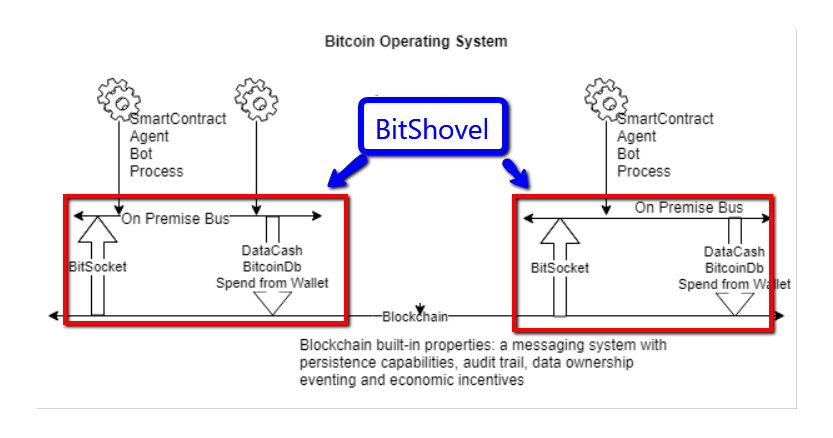

# Why use BitShovel for your blockchain apps?  

1) Easily read and write messages to bitcoin in [any language](#examples)
2) Combines read and write operations into a single simple API
3) Builds on top of [unwriter]((https://github.com/unwriter)) [excellent libraries](https://github.com/21centurymotorcompany)
4) Easy to deploy using Docker
5) Provides a simple messaging infrastructure (pubsub, work queues, etc.) for all your applications
6) Compatible with event driven programming and microservices architectures
7) Additional application services will plug in to the messaging infrastructure with a simple Docker install

## What is BitShovel?
BitShovel fully embraces the bitcoin architecture [unwriter](https://github.com/unwriter) explains in [Bitsocket: The Realtime API for Bitcoin](https://www.yours.org/content/bitsocket--the-realtime-api-for-bitcoin-0c646d55c152)

Think of BitShovel as a bitcoin application accelerator - a building block for Metanet. *Bitcoin is the universal messaging system.* 
* If you need to broadcast a message to a remote process or you want to preserve an immutable audit trail of your message then broadcast it on bitcoin. 
* To broadcast a message to just your applications send a message on the local bus.

**Simple!**

BitShovel is not a library. It is an downloadable application service that runs in a process on your local network. You communicate with BitShovel by sending it messages. A sequence of messages form a workflow of events. 

With BitShovel your workflow can listen to events that happen on bitcoin. It can also kick off a remote workflow by sending a message to bitcoin. Your application is now a bot, an oracle, an autonomous agent, a smart contract, a living entity on bitcoin.



The name BitShovel comes from its utility as a low level tool. 'Shoveling' is the term for scooping a message on one message bus and forwarding it onto another message bus. Sometimes the same action can be referred to as a bridge or an extender.

## Install using Docker Compose
```
git clone https://github.com/dfoderick/bitshovel
cd bitshovel
```
Run the following command *once* to build the docker image.
```
docker-compose build --no-cache
```
Thereafter, run the following command (notice the `no-recreate` option) so that your private keys in wallet.json will not get wiped out.
```
docker-compose up --no-recreate
```
To find out what docker containers are running use
```
docker ps
```
## Configure your private keys
>
> *An Important Note on Private Keys!*  
> It is very easy to lose the private keys on a development server in Docker. Do not store a large amount of bitcoin in your wallet. Fund the wallet with small amounts and make backups of your private keys
>

If you want to write data to bitcoin then BitShovel will need private keys for your wallet.
BitShovel will create a wallet.json by default when it starts up. You can either update
the wallet.json file with your own private keys or you can fund the wallet that BitShovel
generated. Use the following command (while BitShovel is running) to find out the wallet address to fund.
```
redis-cli GET bitshovel.wallet.address
```
The easiest way to fund the wallet is by using moneybutton to withdraw to the BitShovel address.  
https://www.moneybutton.com/test

## Create your app
Any process that can read and write messages can now be a blockchain app. [See examples below](#examples). Test that your BitShovel instance is running using the command lines below and then get started writing apps.

# Test BitShovel from command line
Open terminal and create a listener for bitcoin messages. Messages will scroll in this process.
```
redis-cli subscribe bitshovel.watch
```
Open another terminal to control BitShovel and start pumping it with commands.  
This command will listen to all messages on the bitcoin network.
```
redis-cli publish bitshovel.stream 'start streamname {"find":{}}'
```
Stop shovel from reading messages.
```
redis-cli publish bitshovel.stream 'stop streamname'
```
For fun, lets listen to all the messages that BitShovel is creating. The following command will get your wallet address.
```
redis-cli get bitshovel.wallet.address
```
Copy and paste it into the following command to listen for transactions on that address.
```
redis-cli publish bitshovel.app 'start walletname PasteYourWalletAddressFromAbove'
```
Send a message to the bitcoin network - requires wallet to be funded and needs double quotes (for now).
```
redis-cli publish bitshovel.send '"Hello from BitShovel!"'
```
After a few seconds delay the bitshovel.watch terminal should show the message that you just sent to bitcoin.  

You can also find the message on bitcoin explorer.  
https://bitgraph.network/explorer/ewogICJ2IjogMywKICAicSI6IHsKICAgICJmaW5kIjogeyAib3V0LmIwIjogeyAib3AiOiAxMDYgfSwgIm91dC5zMSI6IkhlbGxvIGZyb20gQml0U2hvdmVsISIgfSwKICAgICJwcm9qZWN0IjogeyAib3V0LiQiOiAxIH0KICB9Cn0=

Query bitcoin for all messages using the demo string using the following query.
```
{
  "v": 3,
  "q": {
    "find": { "out.b0": { "op": 106 }, "out.s1":"Hello from BitShovel!" },
    "project": { "out.$": 1 }
  }
}
```
You could also search using searchbsv.com..  
https://searchbsv.com/search?q=BitShovel


You can also send a Bitquery query to BitShovel and it will replay the bitcoin messages on your local message bus. This query will get the last bitcoin message and publish it on your local bus.
```
redis-cli publish bitshovel.query '{"find":{},"limit":1}'
```

# Bitshovel Events (aka Channels or Topics)
* **bitshovel.watch**  
  Subscribe to this event to get notified when a new bitcoin message appears on the local bus.
* **bitshovel.send**  
  Publish message to this channel to write to bitcoin
* **bitshovel.stream**  
  Start (Stop) listening to bitcoin messages. Pass it the Bitquery. Bitcoin messages that match the query filter will be forwarded to the local bus.
* **bitshovel.query**  
  Get historical transactions from the bitcoin network. Tx that match the query will be replayed on the local bus.
* **bitshovel.wallet**  
  Update the wallet to use a new private key
* **bitshovel.app**  
  Application level commands. Currently allows listening for messages for a single application (address)

# Examples
A Python program to send (write) to bitcoin.
```
import redis
bus = redis.Redis()
bus.publish("bitshovel.send",'"Hello from BitShovel! Python"')
```
A Python program to listen to bitcoin messages on the local bus.  
To see messages in this window you have to also tell BitShovel to watch for messages on bitcoin.  
e.g. redis-cli publish bitshovel.stream 'start streamname {"find":{}}'
```
import redis
bus = redis.Redis().pubsub()
bitshovel_reader = bus.subscribe("bitshovel.watch")
for message in bus.listen():
    print(message)
```
A golang program to write to bitcoin.
```
package main
import "github.com/go-redis/redis"
import "log"
func main() {
	client := redis.NewClient(&redis.Options{
		Addr:     "localhost:6379",
		Password: "", // no password set
		DB:       0,  // use default DB
	})
	_, err := client.Publish("bitshovel.send", "Hello from BitShovel! Go").Result()
	if err != nil {
		log.Fatal(err)
	}
}
```

# Native install for Developers
Normal users can run BitShovel using the Docker instruction above. Developers wishing to customize the app can install it natively to edit the source file.

## Install redis
Install and run redis using  
```
docker run --name bitshovel-redis -d redis
```

## Get source code
```
git clone https://github.com/dfoderick/bitshovel
cd bitshovel
npm install
```
## Run BitShovel server
```
node bitshovel.js
```
will respond with 'Connected to local bus...'
